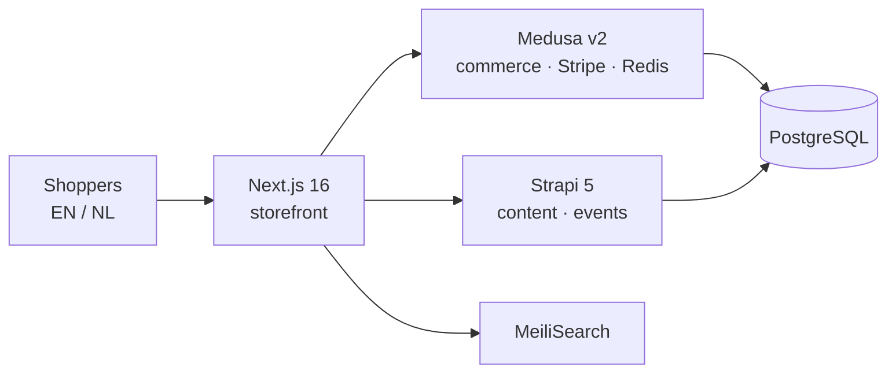

# Josef Vito Evangelista

### Freelance Full-Stack Developer · Next.js · TypeScript · Headless Commerce

> 🟢 **Open to full-time remote roles and contracts with European & US companies and agencies.**

| | |
|---|---|
| **Start** | Immediately |
| **Hours** | Overlap with both EU and US working hours |
| **Engagement** | Full-time contract or employment · freelance projects |
| **Based in** | Philippines (UTC+8) · fully remote |

## Featured work

**Headless commerce + booking platform** for a Netherlands-based retail brand *(client work, private repo)*. Built independently from first design to production.

- Three services with strict data ownership: commerce in Medusa, content in Strapi, presentation in Next.js
- Accounts, cart, checkout, payments and a booking flow with database-level concurrency protection
- GitHub Actions CI with per-service checks, Playwright end-to-end journeys, Railway + Vercel deploys

## Stack

            

## How I work

- **Reliability by design:** data integrity, safe concurrency and well-defined service boundaries
- **Written decisions:** architecture decision records, documented runbooks
- **Verified before shipped:** unit, integration and end-to-end tests in CI

## Contact

📩 josefvitomangalino@gmail.com · 💼 [LinkedIn](https://www.linkedin.com/in/josefvitoevangelista/) · 🌐 [josefvito.site](https://josefvito.site/)
